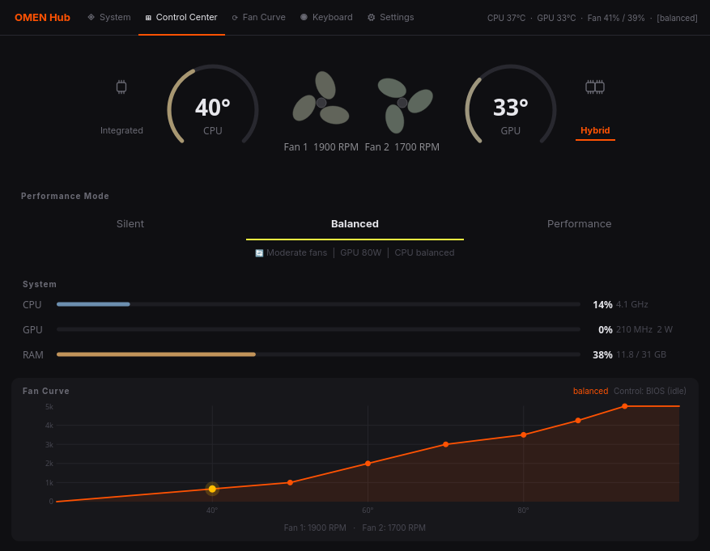
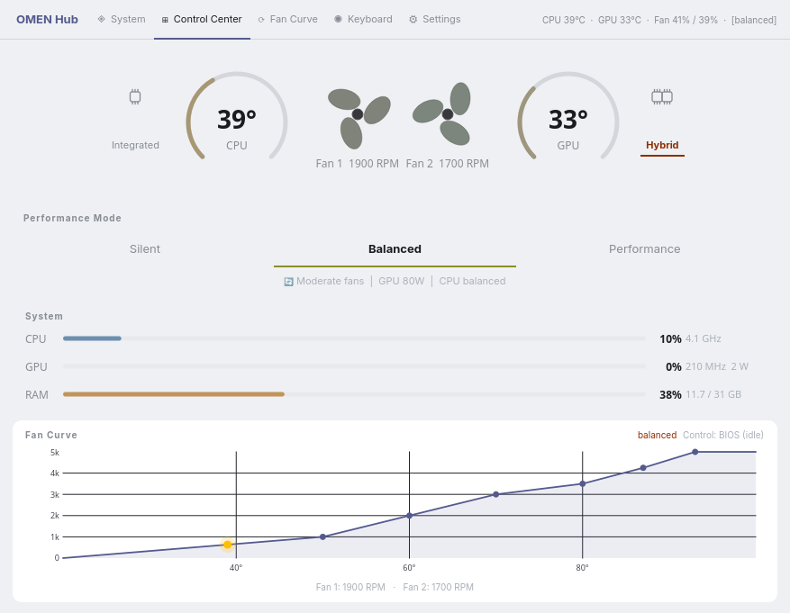
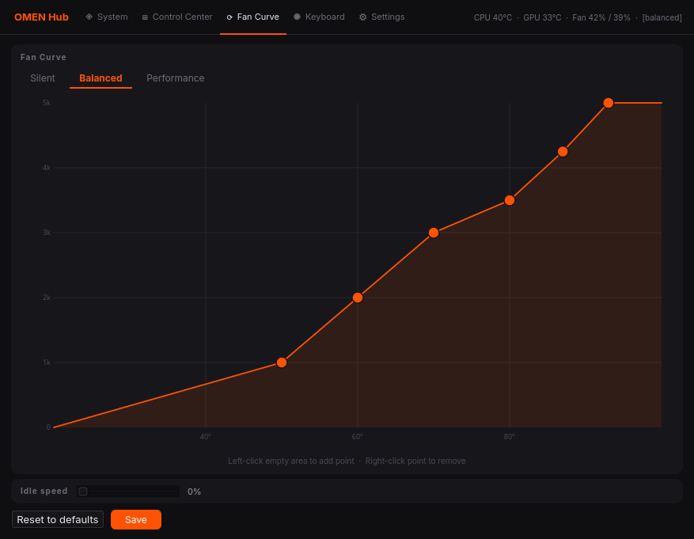
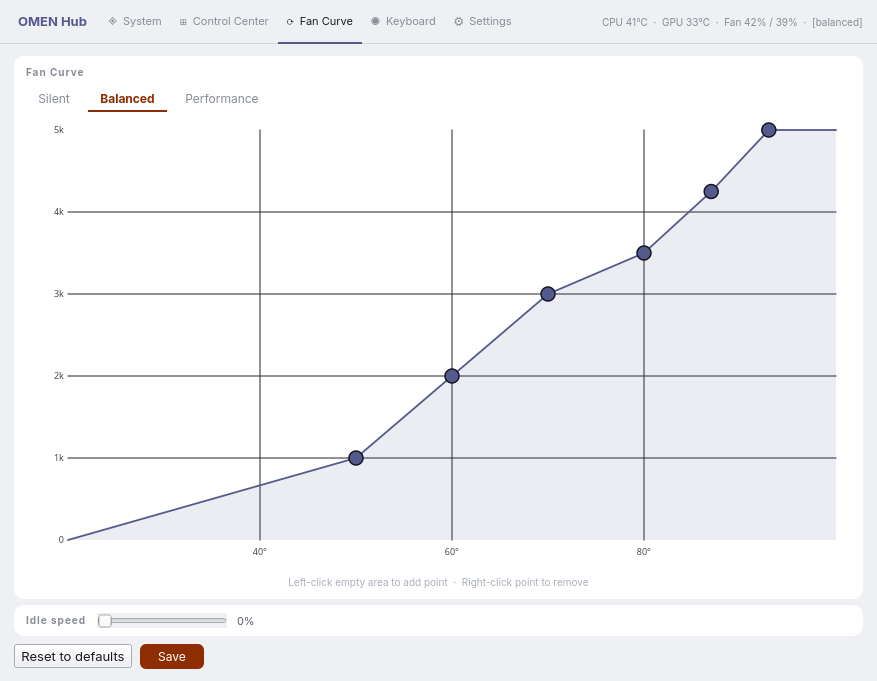
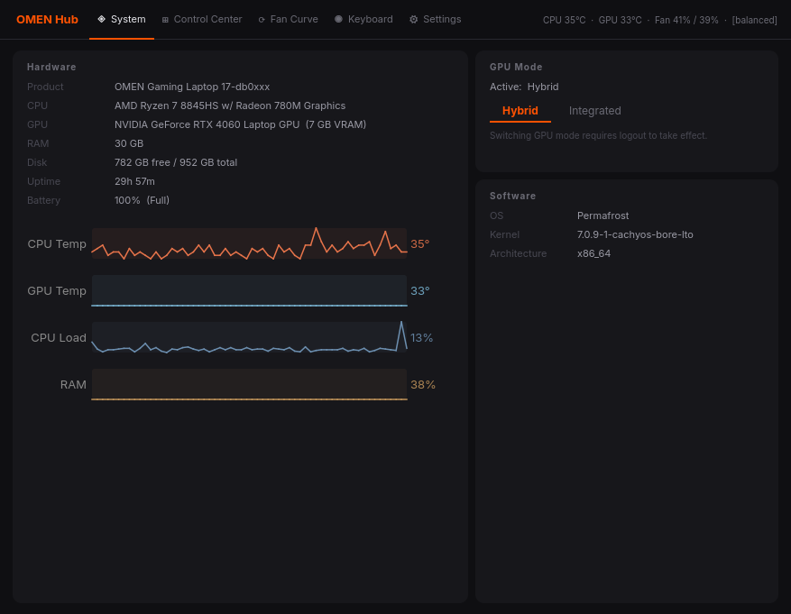
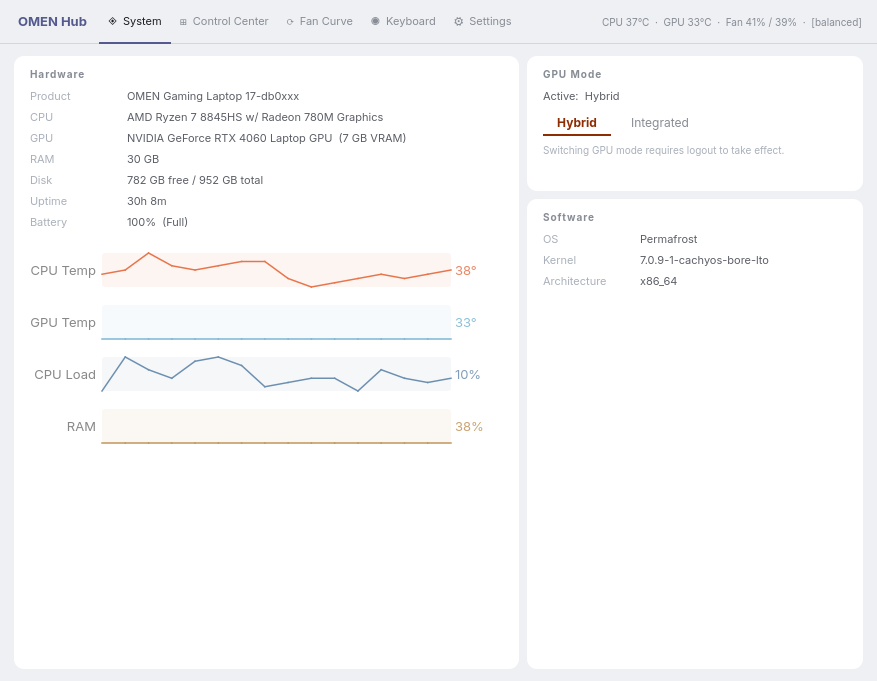
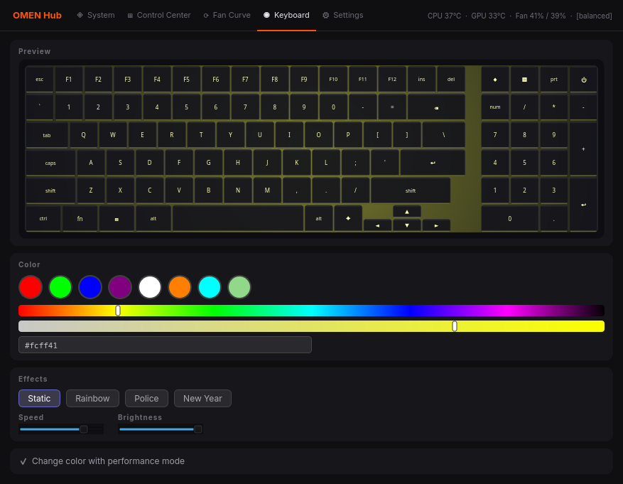
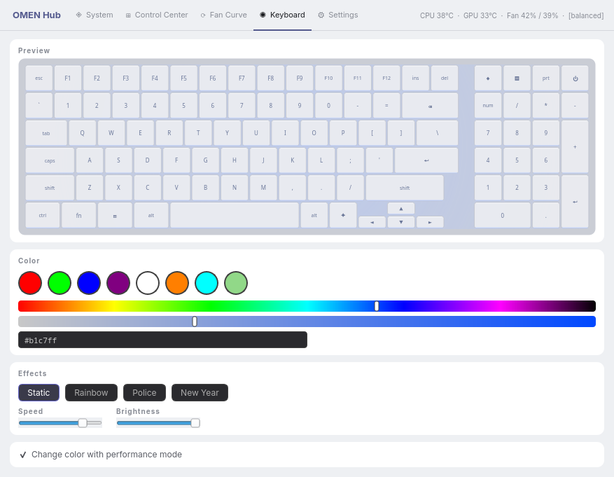
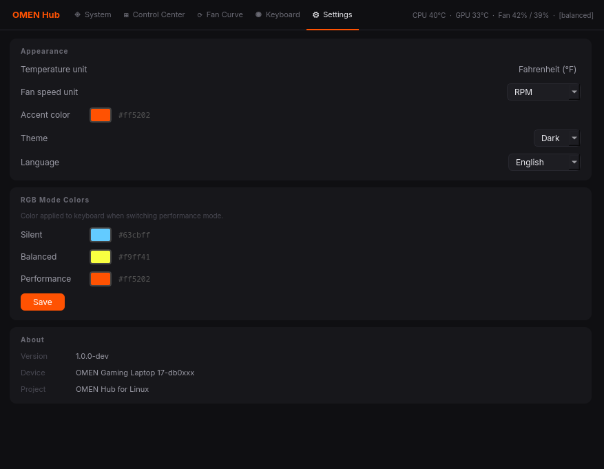
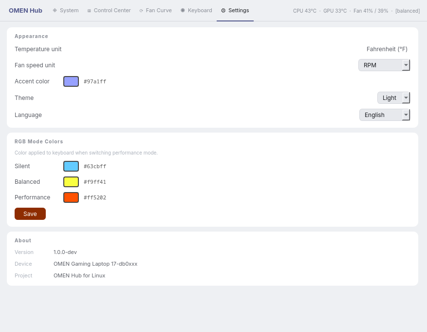

# OMEN Hub for Linux

A modern, lightweight GUI replacement for HP OMEN Gaming Hub on Linux (Arch/CachyOS/NixOS). Control GPU modes, fan curves, RGB lighting, and monitor system thermals.

**Works on:** HP OMEN 16/17 (AMD Ryzen + RTX), Arch Linux, CachyOS, Niri WM.

## Features

- 🎮 **GPU Switching** — Integrated ↔ Hybrid mode without reboot (via `supergfxctl`)
- 🌡️ **Real-time Sensors** — CPU/GPU temps, fan RPM, system load (CPU/GPU/RAM)
- 🎛️ **Fan Curves** — Balanced/Silent/Performance presets, live editing
- ⌨️ **Keyboard RGB** — Per-key backlight preview with mode-specific colors
- 🌙 **Dark/Light Theme** — Live switching, accent color customization
- 🌍 **Multilingual** — English, Русский, extensible
- 📦 **Minimal** — PyQt6, no external daemons required

## Screenshots

<table>
<tr>
  <td></td>
  <td></td>
</tr>
<tr>
  <td align="center"><sub>Control Center · Dark</sub></td>
  <td align="center"><sub>Control Center · Light</sub></td>
</tr>
<tr>
  <td></td>
  <td></td>
</tr>
<tr>
  <td align="center"><sub>Fan Curve · Dark</sub></td>
  <td align="center"><sub>Fan Curve · Light</sub></td>
</tr>
<tr>
  <td></td>
  <td></td>
</tr>
<tr>
  <td align="center"><sub>System · Dark</sub></td>
  <td align="center"><sub>System · Light</sub></td>
</tr>
<tr>
  <td></td>
  <td></td>
</tr>
<tr>
  <td align="center"><sub>Keyboard · Dark</sub></td>
  <td align="center"><sub>Keyboard · Light</sub></td>
</tr>
<tr>
  <td></td>
  <td></td>
</tr>
<tr>
  <td align="center"><sub>Settings · Dark</sub></td>
  <td align="center"><sub>Settings · Light</sub></td>
</tr>
</table>

## Installation

### Arch / AUR (recommended)
```bash
yay -S omen-hub
# Then see "What Works / What Requires Setup" below to enable features
```

**Post-install (recommended):**
```bash
# For GPU switching + fans:
sudo pacman -S supergfxctl omenctl-git polkit
sudo systemctl enable --now omenctl

# For fan reading:
sudo usermod -aG wheel $USER  # Add yourself to wheel group
# Log out and back in
```

### Manual
**Dependencies:**
- `python` ≥ 3.10
- `python-pyqt6` ≥ 6.0
- `python-tomlkit`
- `supergfxctl` (required for GPU mode switching)
- `omenctl-git` (optional; for fan RPM readings and control daemon)

**Install:**
```bash
git clone https://github.com/yourusername/omen-hub.git
cd omen-hub
python -m venv .venv
source .venv/bin/activate
pip install -r requirements.txt

# Run directly from source:
python -m gui.app
```

**Without omenctl daemon:** app will work but fan RPM readings and curve editing are unavailable. CPU/GPU temps and mode switching still functional.

## Usage

After installation:
```bash
omen-hub              # Launch from terminal, or find in app menu (rofi/dmenu/etc)
```

**After AUR install (`yay -S omen-hub`):**
- Binary: `/usr/bin/omen-hub` (symlink to Python script)
- App installed: `/opt/omen-hub/`
- Desktop file: `/usr/share/applications/omen-hub.desktop`
- Appears in: rofi, dmenu, system app menus (if configured)
- Config: `~/.config/omen-hub/settings.json`

Settings are saved to `~/.config/omen-hub/settings.json`:
- Theme (dark/light)
- Language (en/ru)
- Accent color
- Fan curve presets

## Architecture

```
omen-hub/
├── core/              # Logic: sensors, fan control, GPU mode, settings
├── gui/               # PyQt6 UI
│   ├── theme.py       # Color palette + role-based QSS
│   ├── i18n.py        # Translations (en/ru)
│   ├── app.py         # Main window, navigation
│   ├── widgets.py     # Custom: TempGauge, FanWidget, Keyboard, etc.
│   └── pages/         # Info, System, Fans, Keyboard, Settings pages
├── config.toml        # Fan curve definitions
└── requirements.txt
```

## Contributing

Contributions welcome! Please:

1. **For bug fixes:** Create an issue first, then PR with description.
2. **For features:** Discuss in an issue before implementing.
3. **Code style:**
   - Python 3.10+, PEP 8
   - Minimal comments (only "why", not "what")
   - Modular: one responsibility per class/function
   - Theme-aware colors: use `theme.color(role)` not hardcoded #hex

4. **Do NOT modify:**
   - `core/settings.py` — central config store (avoid edit conflicts)
   - `gui/i18n.py` — translation keys (coordinate in issues first)
   - `gui/theme.py` — theme system (extend, don't rewrite)

5. **Testing:** Run offscreen before submitting:
   ```bash
   HOME=/tmp/omenverify QT_QPA_PLATFORM=offscreen python -m gui.app
   ```
   This ensures your changes don't break the user's `~/.config/omen-hub/settings.json`.

## Translation

To add a language, edit `gui/i18n.py` — add a new language dict to `_TR`. Keys follow pattern: `nav_*`, `hw_*`, `gpu_*`, etc.

## What Works / What Requires Setup

### ✓ Works out-of-the-box
- **Temps & Load:** CPU/GPU temps, system load (CPU/GPU/RAM) — no privileges needed
- **Theme/Language:** Dark/light switching, language selection, accent colors
- **Mode Descriptions:** Balanced/Silent/Performance mode info

### ⚠️ Requires additional setup

| Feature | Status | How to Fix |
|---------|--------|-----------|
| **GPU Mode Switch** | Needs `pkexec` | Install `polkit` + ensure PolicyKit agent running (usually automatic on GNOME/KDE) |
| **Fan RPM Reading** | Needs `omenctl` daemon | `sudo pacman -S omenctl-git && sudo systemctl enable --now omenctl` |
| **Fan Curve Control** | Needs `omenctl` daemon | Same as above |
| **Keyboard RGB** | Needs kernel support | See below ↓ |

### 🔧 Keyboard RGB Setup

RGB control requires access to the embedded controller (EC). Depending on your system:

**Option 1: Via kernel module (if available)**
```bash
# Check if module is loaded:
lsmod | grep hp_wmi
lsmod | grep asus_ec

# If not, try:
sudo modprobe hp_wmi
# or
sudo modprobe asus_ec_sensors
```

**Option 2: Custom kernel with ACPI EC support**
- Arch Linux / CachyOS with `linux-zen` or `linux-cachyos` kernels usually include EC access
- If keyboard RGB still doesn't work, your model may not have exposed EC RGB controls

**Option 3: (Not recommended) Run as root**
```bash
sudo omen-hub
```

### 🚨 Troubleshooting

**"authorization cancelled" when switching GPU modes:**
- Check PolicyKit is running: `systemctl status polkit` or `systemctl status org.freedesktop.PolicyKit1`
- If missing, install: `sudo pacman -S polkit`
- Ensure you're in `wheel` group: `groups | grep wheel`
  - If not: `sudo usermod -aG wheel $USER` (then log out/in)

**Fan RPM shows 0 / "Fan controller not detected":**
```bash
# Check daemon status:
systemctl status omenctl

# If not running:
sudo systemctl enable --now omenctl

# Check if omenctl binary exists:
which omenctl-fand
```

**Keyboard RGB not changing color:**
- Verify `supergfxctl -g` works (GPU mode reading works)
- Try running as root once to test: `sudo omen-hub`
- Check kernel module: `lsmod | grep -E "hp_wmi|asus_ec"`
- Your laptop model may not expose RGB via EC (check OmenCtl source for supported models)

**App doesn't appear in rofi/dmenu:**
- Rebuild app menu cache (depends on your DE):
  - GNOME: `update-desktop-database ~/.local/share/applications`
  - KDE: Menu should auto-update
  - i3/sway: Manually add to config: `exec omen-hub`
- Or launch directly: `omen-hub` or `/usr/bin/omen-hub`

**"ModuleNotFoundError: No module named 'PyQt6'":**
- Ensure dependencies are installed:
  ```bash
  sudo pacman -S python-pyqt6 python-tomlkit supergfxctl
  ```
- Or if running from source: `pip install -r requirements.txt`

## License

GPL-3.0 — See LICENSE file.

## Credits

Inspired by [OmenCtl](https://github.com/coolercontrol/OmenCommandCenterForLinux), uses `supergfxctl` for GPU switching.
